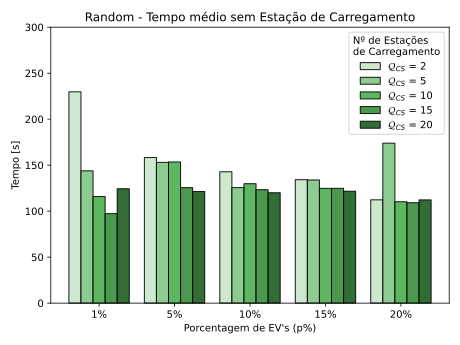
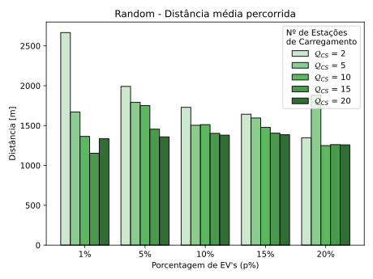
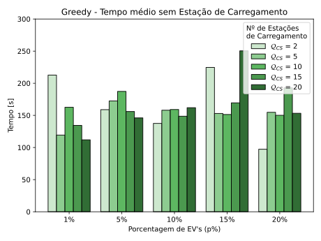
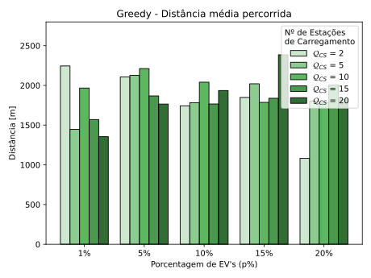
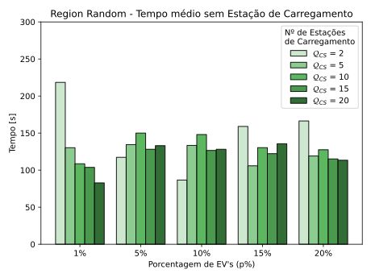
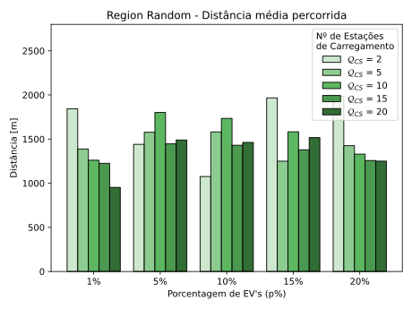
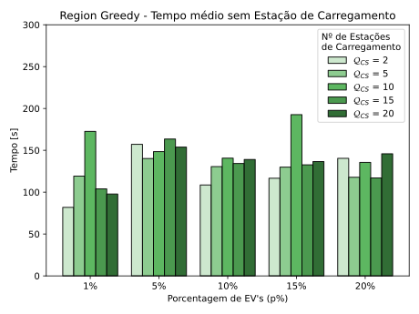
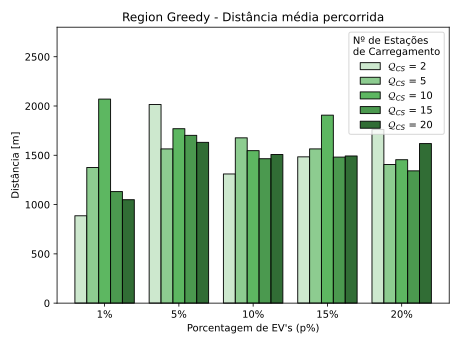

# IC-redes-veiculares
Repositório destinado aos trabalhos desenvolvidos no âmbito do projeto de Iniciação Cientifica sobre o tema **"Soluções para redução de congestionamento em Redes Veiculares e Veículos Elétricos"**. DECOM - UFOP


## Descrição

Este projeto investiga estratégias para o **posicionamento de estações de recarga** em redes viárias, com o objetivo de melhorar o atendimento a veículos elétricos e reduzir impactos como:

- Tempo de deslocamento até estações.
- Distância percorrida.
- Possíveis congestionamentos associados à demanda por recarga.

As simulações são realizadas utilizando o simulador de tráfego [SUMO (Simulation of Urban Mobility)](https://github.com/eclipse-sumo/sumo).

O trabalho tem como principais objetivos:

- Elabaorar um framework de simulação de veículos elétricos;
- Avaliar estratégias de deposição de estações de recarga;
- Investigar o efeito da distribuição espacial das estações.

Foram avaliados comparativamente os métodos de deposição Aleatória, Gulosa, Aleatória por região (*Region Random*) e Gulosa por Região (*Region Greedy*).
Os resultados obtidos indicam que abordagens baseadas em regiões apresentam desempenho superior às versões simples dos métodos avaliados, proporcionando reduções significativas no tempo e na distância percorrida pelos veículos até o atendimento. 

Além disso, observa-se que a abordagem gulosa baseada em regiões apresenta maior consistência no atendimento da demanda, embora soluções aleatórias também apresentem desempenhos competitivos nos cenários simulados.


## Pré-requistos
- Python 3
- SUMO 1.23.1 ou superior

para a geração do ambiente virtual python com as dependências listadas em `requirements.txt` execute:

```bash
make
```

## Execução

A partir da raiz do projeto:

```bash
python -m evsim.main
```

## Geração de cenários de teste

Exemplo de geração dos arquivos de rota para os cenarios de teste:

```bash
python -m evsim.tools.generic_routes -wd scenarios/BH -i bh.net.xml -o bh_routes.rou.xml -n 5000 -f0

python -m evsim.tools.define_ev -wd scenarios/BH -i bh_routes.rou.xml -p (0.01, 0.05, 0.1, 0.15, 0.2) -n 5
```

## Simulações

### Parametrização

Cada simulação considerada durante a avaliação dos métodos utilizou 3000 veículos com  a  proporção de veículos elétricos variando de 1% a 20%. Foram simulados 3600 passos de simulação (o equivalente a 1 hora de condução contínua dos veículos simulados), sendo que, a cada veículo, foi atribuída uma rota aleatória. Define-se ainda um modelo de veículo elétrico, e uma estação de carregamento padrão fixa com as seguintes configurações:


| Atributo              | Valor | Unidade / Domínio |
|-----------------------|-------|-------------------|
| Largura               | 5     | $[m]$             |
| Aceleração            | 2.6   | $[m/s^2]$         |
| Desaceleração         | 4.5   | $[m/s^2]$         |
| Velociadade máxima    | 50    | $[km/h]$          |
| Capacidade da Bateria | 30000 | $[Wh]$            |

**Tabela 1:** Configuração do modelo de Veículo elétrico padrão.


| Atributo         | Valor | Unidade / Domínio |
|------------------|-------|-------------------|
| Potência         | 22000 | $[W]$             |
| Eficiência       | 0.95  | $\in [0,1]$       |
| Capacidade       | 2     | $\in \mathbb{N}$  |
| Largura          | 8     | $[m]$             |

**Tabela 2:** Configuração da Estação de Carregamento padrão utilizada.


Considera-se que cada pista na rede de simulação pode receber apenas uma estação de recarga ao longo de seu comprimento, ou seja, cada pista pode ser selecionada apenas uma vez para a solução, e as estações são instaladas próximas ao ponto médio destas pistas.

Demais parâmetros específicos do domínio de simulação podem ser encontrados em `evsim/params.py`.

### Resultados

A seguir, apresentam-se os resultados gerais obtidos para cada método. Nos gráficos, os valores mostrados para cada configuração representam uma média de $\mathcal{R}$ diferentes amostragens com $\mathcal{R} = 5$. As métricas consideradas para a avaliação da eficácia das soluções foram o tempo médio $\mathcal{T}$ e a distância média $\mathcal{D}$ percorrida pelos veículos elétricos até serem atendidos em uma estação de recarga.

<figure>
    <div style="display: flex; gap: 10px;">
        
        
    </div>
    <figcaption><strong>Figura 1:</strong> Métricas para a Deposição Randômica </figcaption>
</figure>

<figure>
    <div style="display: flex; gap: 10px;">
        
        
    </div>
    <figcaption><strong>Figura 2:</strong> Métricas para a Deposição Gulosa </figcaption>
</figure>

<figure>
    <div style="display: flex; gap: 10px;">
        
        
    </div>
    <figcaption><strong>Figura 3:</strong> Métricas para a Deposição Regional Randômica </figcaption>
</figure>

<figure>
    <div style="display: flex; gap: 10px;">
        
        
    </div>
    <figcaption><strong>Figura 4:</strong> Métricas para a Deposição Regional Gulosa </figcaption>
</figure>
